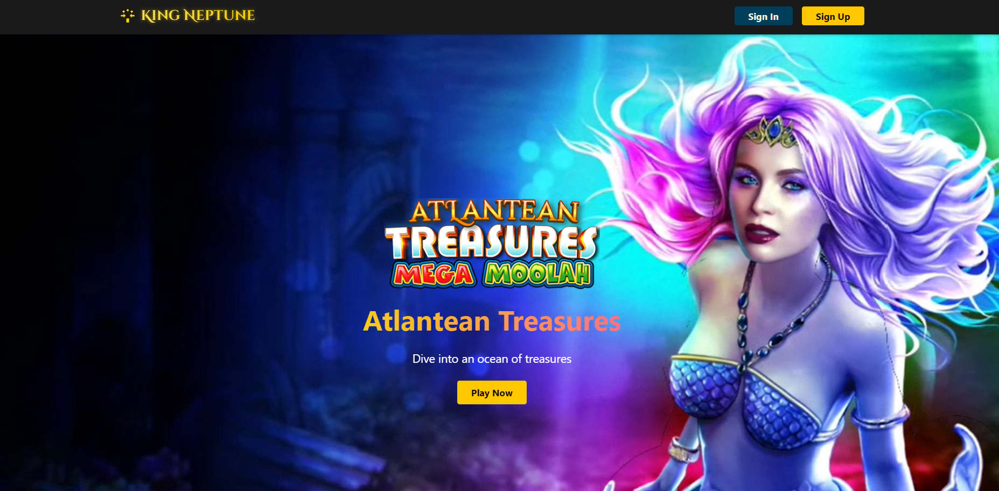

# Atlantean Treasures Landing Page

A responsive, modern landing page built with Nuxt 3 for online casino promotions



## 📋 Project Overview

This project demonstrates a production-ready landing page built with Nuxt 3, showcasing modern web development best practices, including performance optimisation, accessibility, and maintainable component architecture.

## ✨ Key Features

* Hero Section with Live Jackpot

Displays a video background and the current jackpot value for "Atlantean Treasures: Mega Moolah", fetched from an external API.

* API Data Integration

Fetches jackpot data from https://jackpots.desdev.co, filters for the relevant game, and handles loading and error states.

* Game List and Gameplay Video

Shows a list of games and an embedded gameplay video to provide context for the promotion.

* Offer Details Section

Lists the main terms of the free spins offer, using icons for clarity.

* Responsive Layout

All components adapt to different screen sizes, supporting both desktop and mobile devices.

* Accessibility

Uses semantic HTML, ARIA attributes, keyboard navigation, and skip links to improve usability for all users.

* TypeScript and Modular Code

Uses TypeScript for type safety and composables for reusable logic.

* SCSS with CSS Variables

Styles are managed with SCSS and CSS variables for maintainability and easy theming.

## 🛠️ Tech Stack

| Category      | Technology          | Purpose                     |
| ------------- | ------------------- | --------------------------- |
| Framework     | Nuxt 3              | Application structure, SSR  |
| Language      | TypeScript          | Type safety                 |
| Styling       | SCSS, CSS Variables | Component and theme styling |
| Build Tool    | Vite                | Fast development/build      |
| Server Engine | Nitro               | API endpoints, server logic |
| Icons         | Lucide Vue          | UI icons                    |

## 🚀 Getting Started

### Prerequisites

- Node.js 18+
- npm or yarn package manager

### Installation

```bash
# Clone the repository
git clone https://github.com/arzucaner/atlantean-landing.git

# Navigate to project directory
cd atlantean-landing

# Install dependencies
npm install
```

### Development

```bash
#Start development server
npm run dev

# Open http://localhost:3000 in your browser
```

### Production

```bash
# Build the project
npm run build

# Start the production server
npm run start
```

## API Endpoints

* `/api/jackpots` – returns current jackpots
* `/api/games` – mock list of casino games

## Live Deployment

You can view the deployed site here:

[https://atlantean-landing.vercel.app](https://atlantean-landing.vercel.app)

---
